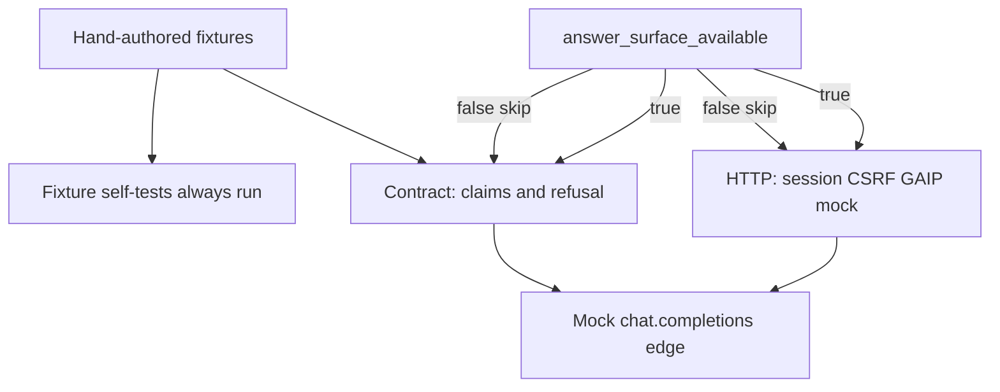

# Gated Answer Quality — Plan Brief

> Full plan: `context/changes/first-gated-answer/plan.md`
> Research: `context/changes/first-gated-answer/research.md`

## What & Why

Analysts must not receive a **confident wrong answer** (PRD Guardrails, FR-005). This plan is test-rollout Phase 2: a fixture oracle plus skip-gated contract/integration tests for grounding, refusal, and session/CSRF/provider failures. It does **not** ship the product Q&A API.

## Starting Point

SSO LoginRequired is live; `/health` stays public. There is no answer route, GAIP client, or fixture corpus. Research.md is stale on auth (it still describes Phase-1-only SSO) but correct on greenfield Django JSON views, GAIP `chat.completions`, root `tests/`, CSRF on POST, and “do not health-allowlist `/ask`”.

## Desired End State

Checked-in fixtures encode supported vs forbidden facts (including “Dataset A weekly” vs invented “90-day retention”). When a real answer surface exists, tests fail invented facts, missing-evidence non-refusals, unauthenticated answers, CSRF-less POSTs, and provider errors rendered as sourced answers. Until then, those tests skip with `answer-surface-missing` — not a false green. Cookbook §6.3 is filled.

## Key Decisions Made

| Decision | Choice | Why (1 sentence) | Source |
| --- | --- | --- | --- |
| Plan owns | Tests/fixtures only; no product API | Lowest cost; API is still greenfield | Plan |
| Grounding contract | Evidence → cited/grounded; empty/irrelevant → refuse | Strongest Risk #1 split | Plan + PRD |
| HTTP shape | Unfixed (abstract surface hook) | Avoid locking `POST /ask` before product design | Plan |
| CSRF | Anon 302; no token 403; token reaches boundary | Matches real cookie-session POST | Plan + research |
| Fixture oracle | `supported_facts` + `forbidden_facts` in §6 | Paraphrase allowed; 90-day invention fails | Plan |
| Provider failure | Deterministic safe non-answer | Must not look like a sourced success | Plan + research |
| Phases | Fixtures → skip-gated suite → cookbook | Combined contract+HTTP after user asked to merge | Plan |
| LLM in CI | None; no LLM-as-judge (checked: 2026-09-14) | Deterministic claims are cheaper signal | Test plan §1 |

## Scope

**In scope:** fixture corpus + self-tests; skip-gated quality + auth/CSRF/GAIP-failure tests; §6.3/§6.4 cookbook.

**Out of scope:** Django `/ask` (or any) implementation, GAIP onboarding, Toqan, live Okta/GAIP, IDOR, routing, follow-ups, AI-native graders, CI YAML, fixture-authoring skill.

## Architecture / Approach

Product later points `SUBMIT_QUESTION` + `ANSWER_HTTP` at real `core` code. Tests never add the path to `EXEMPT_PATHS`.

## Phases at a Glance

| Phase | What it delivers | Key risk |
| --- | --- | --- |
| 1. Fixture oracle | Four cases + loader self-tests | Goldens copied from a model |
| 2. Conditional suite | Skip-gated contract + HTTP/provider tests | Skip treated as Risk #1 coverage; or a stub unskips them |
| 3. Cookbook | §6.3/§6.4 filled | Updating strategy §1–§5 by accident |

**Prerequisites:** SSO floor (done). No GAIP key required for this change.
**Estimated effort:** ~1–2 sessions across 3 phases; Phase 2 stays skip-gated until a later product slice.

## Open Risks & Assumptions

- Risk #1 is **not empirically protected** until `answer_surface_available()` is true against real code.
- `test-plan.md` §3 Phase 2 must not be marked `complete` while the suite only skips.
- Research.md auth text will keep confusing implementers unless they follow this plan’s “stale” warning.

## Success Criteria (Summary)

- Fixtures can fail a 90-day invention without calling any model.
- Pytest is green: Phase 1 tests pass; Phase 2 tests skip with a named reason (today).
- Cookbook tells the next author how to add a case and how to activate the surface hook without exempting the route.
